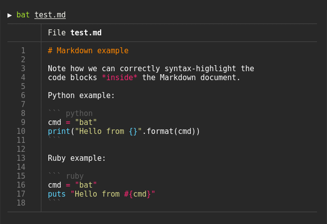

### Bat
Similar to `cat` command, but allows syntax hightlighting. Also, shows diff of code.



### Fzf
Install using 
`brew install fzf`  
Install keybindings using `/opt/homebrew/opt/fzf/install`

To allow fuzzy search directories, add this to `~/.zshrc`
```
# fcd - cd to selected directory
fcd() {
  local dir
  dir=$(find ${1:-.} -path '*/\.*' -prune \
                  -o -type d -print 2> /dev/null | fzf +m) &&
  cd "$dir"
}
```

Now, type `fcd` to search for files in current and recursive directories.


### Credits:
https://www.youtube.com/watch?v=d4bTkiftBOk&t=11s&ab_channel=warpdotdev
